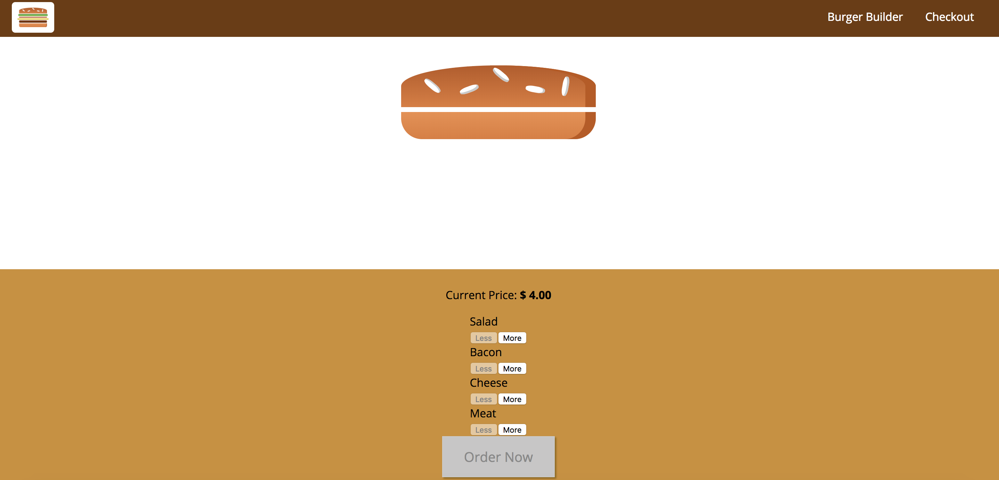

## Burger Builder:

An app that allows one to build a burger and checkout that order of that burger. This was a demo project on how to build a React Project from the ground up. 

This is still a work in progress as it requires routing and server access




## How to Use:

1. Clone the repo
```
git clone https://github.com/thatdania/BurgerBuilder-.git
```
2. Change the project folder directory
```
cd BurgerBuilder-
```

3. Npm install (for all the packages)
```
npm install
```

4. Npm start to get it going, to give it a try
```
npm start 
```

